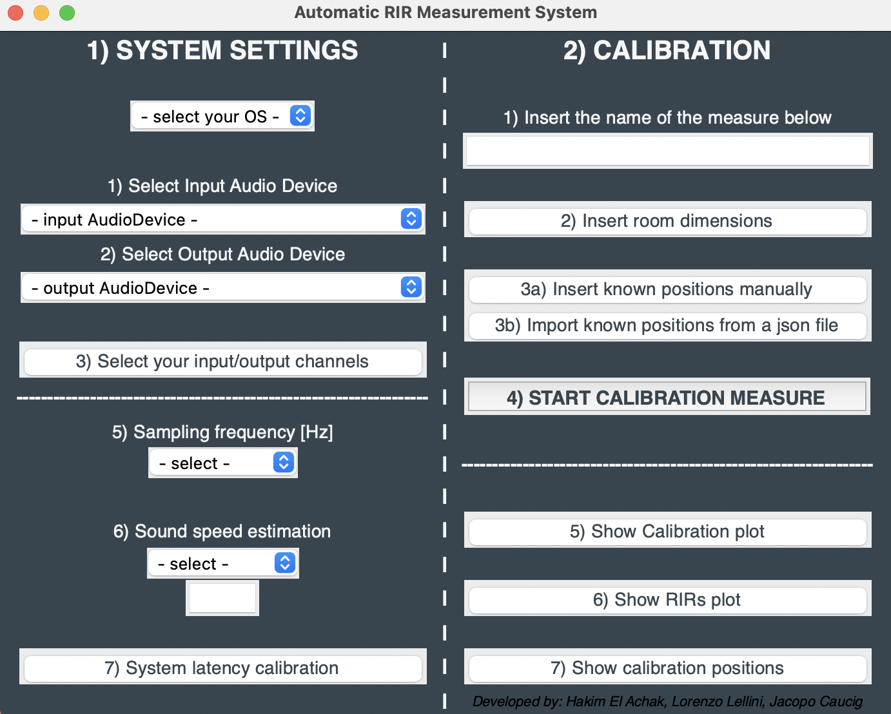

## Project_Course_2022
### Authors:
Jacopo Caucig -
Lorenzo Lellini - 
Hakim El Achak

# Acoustic Measurement Framework for Room Impulse Response Dataset and Sound Source Localization

A compact tool, fully developed in Python, for the acquisition of Room Impulse Responses and Sound Source Localization based on its acoustical informations. 

## USER INTERFACE

That is how it looks the GUI at the starting point and it can be seen that it is mainly divided into 2 sections: 'SYSTEM SETTINGS' and 'CALIBRATION'.

### SYSTEM SETTINGS

This section is dedicated to the declaration of specific parameters and technical aspects needed for the RIR's acquisition. 

In particular, in the first part (point 1,2,3) it asks you to choose the proper audio devices where the needed inputs/ouputs channels are connected. A routing matrix (in the fig. below) allows you to choose from the selectable channels the right number of inputs and outputs that you are going to use. 

####immagine matrix

In the second part instead (point 4,5,6), you can choose between two types of measures for RIRs acqusition, MLS and Exponential Sine Sweep. Other parameters as the sampling frequency and the proper sound speed must be declared for the computation to be accurate. 

The numerical order was put on purpose in order to facilitate the user to follow the step in a right manner.

### CALIBRATION

System latency may differ from device to device so a simple method for the estimation of the used device's latency was implemented; this is crucial for the RIRs to be correct. As it can be seen in the figure below, after pressing the button (point 1) a secondary window will open in which all the needed passages are specified. 

