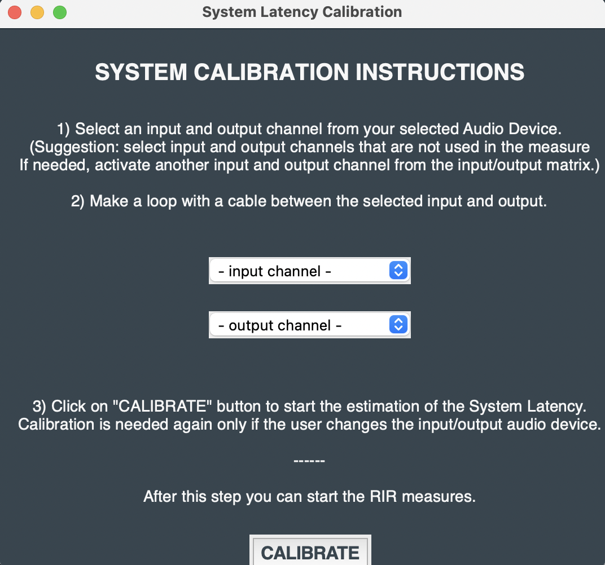

## Project_Course_2022
### Authors:
Jacopo Caucig -
Lorenzo Lellini - 
Hakim El Achak

# Acoustic Measurement Framework for Room Impulse Response Dataset and Sound Source Localization (Calibration?)

A compact tool, fully developed in Python, for the acquisition of Room Impulse Responses and the creation of high quality Dataset. It also performs Sound Source Localization based on RIR acoustical informations.

## USER INTERFACE

That is how it looks the GUI at the starting point and it is mainly divided into 2 sections: 'SYSTEM SETTINGS' and 'CALIBRATION'.

### SYSTEM SETTINGS

This section is dedicated to the declaration of specific parameters and technical aspects needed for the RIRs's acquisition. 

In particular, in the first part (point 1,2,3) it asks you to choose the proper audio devices where the needed inputs/ouputs channels are connected.
A routing matrix (fig. below) allows you to choose from the selectable channels the right number of inputs and outputs that you are going to use. 

In this specific example the number of the max_num available of input/output was 30. 

In the second part instead (point 4,5,6), you can choose between two types of measures for RIRs acqusition, MLS and Exponential Sine Sweep. 
Other parameters as the sampling frequency and the proper sound speed must be declared for the computation to be accurate. 

The numerical order was put on purpose through all the GUI in order to facilitate the user to follow the step in a right manner.

### CALIBRATION

System latency may differ from device to device so a simple method for the estimation of the used device's latency was implemented; this is crucial for the RIRs to be correct. 
After pressing the button (point 1) a secondary window will appear in which, as it can be seen in the figure below, all the needed passages are specified. 

At this point, after naming the measurment folder, some parameters such as 'room dimensions' and 'known source positions' are needed by the calibration algorithm in order to be correctly functional. 
The known positions of the inital sound sources can be entered manually or by uploading a proper json file (later specified). 
As this proccess is symmetric, in both cases it is requeired to specify the tipology of source (microphone or loudspeaker) of which the calibration is desired.

Now, since the apllication has all the preliminary data, by pressing the corresponding button the actual calibration will start. 

At this point it is necessary to wait for the acquisition by all of the selected microphones together with the RIR creation and sound source localization. Based on the number of inputs/outputs chosen, obviously the computational cost changes.

(?) At the end of the measure, you will obtain a proper Dataset organized in this way:
- a .json file in which are reported the measurement conditions and room properties and the estimated source positions;
- a folder for each known source in which there are:
     - a .wav file of the RIR of each microphone, of the actual recordings and of the input test signal
     - a .npy file containing the storage Matrix of the RIRs

Point 7 and 8 show respectively the 3D plot of the sources position estiamtion and the RIRs's waveforms acquired. 
Point 9 prints the coordinates esatimed positions. 

###immagini plots ecc.

## IMPLEMENTATION

The cod for the measure and the acquisition or the RIR is based on 'pyrirtool' [1], an algorithm that recall the ESS method and its modifications proposed by Angelo Farina [2]. Several python packages are used, one of the main is 'sounddevice' which is responsble for recording and playback.

***Required packages***: a the .txt file is included in the project folder in which it can be found the complete list of all the packages needed by the algorithm to be correctly functional. 

### REFRENCES
[1] pyrirtool
[2] paper farina
